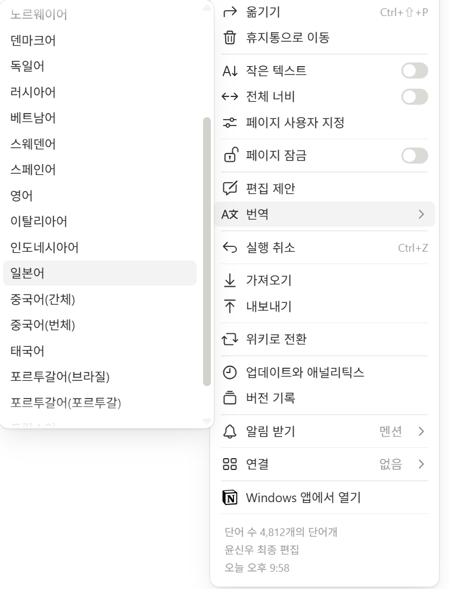
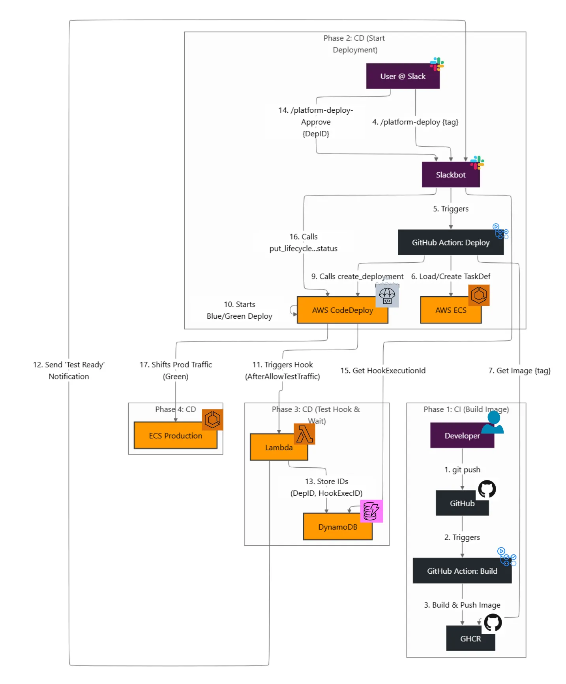

# 치이카와, 오늘도 배포 중입니다

<aside>
 팀 소개 / 팀원 / 역할
チーム・ウォーターメロン
*初めて出会った4人の男たちのブロマンス*

🧑‍🎓 **고은호**
- 클라우드 & CI/CD 자동화 담당
- CI/CD 자동화 및 Slack 연동 총괄
- GitHub Actions와 AWS CodeDeploy를 활용해 자동화된 Blue-Green 배포 파이프라인 구축
- Slack Bot을 통해 개발자가 직접 대화로 배포를 수행
- 감정형 DevOps 경험의 핵심 구조를 완성

🧑‍🎓 **고영민**
- 서버리스·클라우드 인프라 담당
- AWS Lambda 함수 생성 및 API Gateway 연동으로 **무중단 배포 로직 구현**
- 배포 승인 및 단계별 진행 상태를 시각화하는 구조 설계
- IAM 및 환경변수 관리, 배포 자동화 파이프라인 내 인증 체계 구성

🧑‍🎓 **이동현** 
- 백엔드 & ECS 인프라 담당
- ECS 및 백엔드 인프라 구축 담당
- AWS ECS 초기 세팅 및 백엔드 서버 설계·배포
- 컨테이너 기반 아키텍처로 안정적 실행 환경 구현
- 백엔드 메트릭(Prometheus) 노출 및 헬스체크 구성
 
🧑‍🎓 **윤신우** 
- 프론트엔드 & 모니터링·기획 담당
- 프로젝트 아이디어 및 스토리라인 기획
- Grafana 기반 Monitoring Dashboard 구축
- Blue-Green 전환용 시각화 웹 페이지 제작
- 문서 콘텐츠 기획, 감정형 DevOps 콘셉트 브랜딩 담당

</aside>

- **設計書の日本語版を確認する方法**
    
    
    
    右側の「翻訳」メニューから「日本語」をクリックすると、日本語に翻訳して表示できます。
    

**목차**

# 프로젝트의 가치

---

## **기술은 차가워도, 개발자는 따뜻하다**

기술은 논리와 효율로 움직이지만, 그 속에서 창조하는 사람은 감정을 지닌 존재입니다.

우리는 서로의 지식과 경험을 나누며, **함께 성장하는 따뜻한 개발 문화**를 추구합니다.

## **귀여움은 인간성을 복원한다**

우리가 말하는 인간성은 거창한 도덕이나 이념이 아닙니다.

그것은 **작은 즐거움과 따뜻한 감정, 그리고 서로를 향한 공감**입니다.

치이카와의 귀여움처럼, 사소한 행복이 모여 우리의 하루를 부드럽게 감싸줍니다.

기술 속에서도 웃음과 온기가 느껴질 수 있도록, 우리는 감정이 있는 경험을 만들어갑니다.

## **배포는 행복을 나누는 일이다**

배포는 단순히 코드를 올리는 과정이 아니라, **작은 즐거움을 느끼는 하나의 경험**입니다.

우리는 그 과정 자체를 따뜻하고 유쾌하게 만들고자 합니다.

배포가 더 이상 긴장과 피로의 순간이 아니라, 

**치이카와의 귀여운 움직임을 보며 미소 짓는 시간**이 되길 바랍니다.

 치이카와가 전하는 귀여움이 개발자들의 하루에 잠깐의 여유와 행복을 배포합니다.

기술은 효율을 만들지만, 그 속의 인간성은 **감정을 느끼는 순간**에서 완성된다고 믿습니다.

# 소개

---

## 목적

개발자에게 **배포 과정 자체가 즐겁고 따뜻한 경험이 되도록** 하는 것이 본 프로젝트의 목적입니다.

우리는 차가운 자동화 시스템 속에서도 **귀여움, 감정, 인간성**을 잃지 않는 개발 문화를 제안합니다.

이 프로젝트는 AWS 기반의 Blue-Green 배포 파이프라인을 자동화하면서도, 

Slack을 통해 치이카와와 함께 **감정이 있는 배포 경험**을 제공합니다.

## 정의 및 약어

| 용어 | 설명 |
| --- | --- |
| **ECS (Elastic Container Service)** | - **AWS의 컨테이너 오케스트레이션 서비스**로, 여러 Docker 컨테이너를 자동으로 관리·배포
- 프로젝트에서는 **Fargate 기반으로 Blue/Green 배포를 구현**하여, 개발자가 서버 관리 대신 **배포 그 자체의 즐거움**에 집중할 수 있도록 함 |
| **Docker** | - 어디서든 똑같이 실행되게 해주는 앱용 상자 
- **모든 구성요소(Prometheus, Grafana, Backend)를 동일한 환경에서 실행할** 수 있게 함 |
| **Lambda** | - **서버 없이 코드만 실행할 수 있는 AWS의 서버리스 함수**로, 배포 후 Hook 이벤트를 처리하며 Blue/Green 전환을 제어 |
| **Blue/Green Deployment** | - **두 개의 프로덕션 환경을 번갈아 사용하여 서비스 중단 없이 새로운 버전을 배포**하는 방식
- 배포 실패 시 즉시 롤백이 가능해, 개발자에게 **무스트레스·무중단 배포의 안정감**을 제공 |
| **Slackbot** | - Slack 명령(`/platform-deploy`)을 받아 자동으로 배포를 수행하는 챗봇 
- 배포 상태를 치이카와 이미지로 전달하며, **대화로 이루어지는 감정형 DevOps 경험**을 제공 |

# Watermelon 팀 회의록

---

# 시스템 개요 및 상세 설명

---

## 시스템 개요

본 프로젝트는 **Slack 기반의 감정형 Blue/Green 배포 시스템**으로,

개발자가 코드를 푸시하면 자동으로 빌드 및 배포가 이루어지며,

배포 승인 과정에서 **치이카와와 함께 즐거운 피드백**을 받을 수 있도록 설계되었습니다.

아키텍처는 “배포는 즐겁고 따뜻한 경험을 나누는 일이다”라는 철학을 실현하기 위해

AWS의 CodeDeploy, ECS, Lambda, Slack API, GitHub Actions를 유기적으로 연동했습니다.

## 아키텍쳐 다이어그램



                                                                                            AWS 기반 CI/CD Blue-Green 다이어그램

## 구성 요소

| 구성 요소 | 역할 및 설명 |
| --- | --- |
| **GitHub Actions** | - `git push` 시 CI 파이프라인을 자동 실행
- Slack으로 배포 상태를 알리고, 사용자가 태그를 선택해 배포 승인 후 CD 파이프라인 실행 |
| **GitHub Container Registry** | - 빌드된 Docker 이미지를 저장하는 컨테이너 레지스트리
- ECS는 여기서 이미지를 가져와 Blue/Green 환경에 배포 |
| **ECS (Elastic Container Service)** | - 컨테이너 기반의 Blue/Green 배포를 담당
- 새 버전(green) 컨테이너를 띄우고, 트래픽 전환을 관리 |
| **CodeDeploy** | - ECS와 Lambda 사이의 배포 흐름을 제어
- 배포 그룹과 라이프사이클 훅을 관리하여 **무중단 배포**를 보장 |
| **Lambda** | - CodeDeploy의 훅 이벤트를 받아 테스트 및 승인 단계 수행 
- DynamoDB에 상태 저장 및 Slack에 알림 전송 |
| **DynamoDB** | - DeploymentID, HookExecutionID를 저장해 Lambda와 CodeDeploy 간의 연결을 유지 |
| **Slackbot** | - `/platform-deploy` 명령으로 배포 시작 및 승인/거절을 담당
- 배포 상태를 **치이카와 이미지로 피드백**하여 감정적 경험을 제공 |

## 배포 흐름

<aside>

**1.** 개발자가 코드 수정 후 `git push` 수행

**2~3.** GitHub Actions가 트리거되어 Docker 이미지를 빌드하고 GHCR에 푸시

**4.** Slackbot이 태그(tag)를 기반으로 배포 승인 요청

**5~7.** 사용자가 승인하면 ECS의 Task Definition 기반으로 새로운 이미지를 배포 준비

**8~9.** Github Actions가 `create_deployment`를 호출하여 Blue/Green 배포 시작

**10~12.** AfterAllowTestTraffic Hook으로 트리거된 Lambda가 테스트 준비 완료 알림 전송

**13~14.** DynamoDB에 DeploymentID와 HookExecutionID 저장 → 승인 후 Green 컨테이너 전환

**15~16.** ECS 라이프사이클 훅 완료 → 트래픽이 Green 환경으로 이동

**17.** 배포 완료 알림 전송 및 최종 치이카와 이미지 출력 🎉

</aside>

## 종속성

| 항목 | 설명 |
| --- | --- |
| **Lambda → CodeDeploy** | Lambda는 배포 후 단계에서 `DeploymentID`, `HookExecutionID`를 CodeDeploy로부터 전달받아야 함 |
| **ECS → CodeDeploy** | ECS 서비스는 CodeDeploy 배포 그룹 생성 시 참조 가능하도록 사전에 CodeDeploy 연동 설정 필요 |
| **Slackbot → GitHub Actions** | `/platform-deploy`으로 GitHub Actions의 배포 워크플로우를 트리거 |
| **DynamoDB → Lambda** | Lambda는 DynamoDB에 저장된 배포 ID 정보를 기반으로 승인/거절 상태를 갱신 |

# 유지 관리 및 보안

---

### **환경 변수 관리**

- `.env` 파일 대신 GitHub Repository Secrets로 관리
- CI/CD 파이프라인(GitHub Actions) 실행 시 Secrets를 통해 주입하여 코드 내 하드코딩 방지
- 환경 변수 노출로 인한 보안사고를 예방하고, 팀원별 접근 권한이 세분화되도록 설정


이러한 방식으로 구성하여, 개발자가 코드 레포지토리 접근 권한만 가지고는 실제 인프라 정보에 접근할 수 없도록 **보안 계층을 강화**했습니다.

### **ESLint 도입을 통한 코드 정적 분석 및 보안 검증**

- 배포 전 `npm run lint` 명령어를 실행하여 **코드 품질과 잠재적 보안 취약점 자동 점검**
- 코드 리뷰 과정에서 린트 규칙을 통과하지 못한 커밋은 병합되지 않도록 **CI 단계에서 자동 검사**를 수행

### AWS IAM 사용자 및 역할 분리

- AWS 리소스 접근을 위해 IAM 사용자 및 역할 을 세분화하여 사용
- 각 팀원의 권한을 최소화하여 불필요한 자원 접근을 차단


- MFA 적용 및 Access Key 주기적 회전 정책을 통해 장기 키 노출 위험을 감소
- 필요 시 `AssumeRole` 정책을 통해 **임시 권한 부여**를 사용함으로써, 보안성과 유연성을 동시에 확보

이를 통해 IAM 접근 로그를 CloudTrail로 추적하고, 비정상 접근 발생 시 즉시 알림을 받을 수 있도록 설정하였습니다.

## 유지 비용

ECS Fargate(1vCPU, 2GB 메모리)의 시간당 비용은 **약 0.05678 USD**이며,

동일한 성능의 EC2 인스턴스(t2.small, Ubuntu 기준)는 **약 0.0306 USD**로 Fargate가 상대적으로 높은 비용을 가집니다.

그러나 Fargate는 OS 관리, 패치, 장애 복구 등 인프라 운영 부담이 거의 없으며, EC2 대비 **관리 시간 및 운영 리스크를 대폭 절감**할 수 있습니다.

따라서 **운영 효율성과 안정성**을 우선시하는 해커톤 환경에서는 Fargate를 선택하는 것이 **총소유비용** 측면에서 더 합리적이다고 판단했습니다.

| 항목 | ECS Fargate | EC2 (t2.small) | 비교 결과 |
| --- | --- | --- | --- |
| 시간당 비용 | 0.05678 USD | 0.0306 USD | EC2가 저렴 |
| 관리 필요도 | 없음 (Fully managed) | 있음 (OS 패치, 장애 대응 필요) | Fargate 우위 |
| 초기 세팅 | 간단 | 복잡 | Fargate 우위 |
| 장애 대응 | 자동 복구 | 수동 대응 필요 | Fargate 우위 |
| **종합 판단** | **관리 비용과 안정성을 고려해 ECS Fargate 선택** |  |  |

<aside>
💡

인프라 관리비용(시간, 장애 대응, OS 패치 등)을 고려해 ECS를 선택

</aside>

# Appendix A. 작지만 확실한 행복을 배포하는 방법

---

## 사용자 경험을 향상시키기

---

- 버튼 한 번으로 환경 구축부터 배포 완료까지 자동화
- 모든 단계가 **Slack 봇 메시지로 전달**되어, 배포 진행 상황을 직관적으로 확인 가능
- **Step1. 배포 승인 및 트리거**


치이카와 봇이 첫 번째로 전송하는 메시지

**Step2. 배포 시작 알림**


귀여운 치이카와의 움짤과 함께 배포 시작 메시지가 전송

**Step 3. ECS 테스트 대기 중**


배포 중간 점검을 알리는 치이카와의 ‘기다림’ 장면이 표시

**Step4. CodeDeploy 승인 완료**


마지막으로, 성공적인 배포 완료 메시지와 함께 귀여운 마무리

## 품질을 높이기

---

배포 전에 자동화된 테스트·Lint·보안 스캔을 수행하여 코드의 품질과 보안을 체계적으로 관리하였습니다.

파이프라인 단계에 **ESLint 검사와 보안 취약점 스캐닝**을 추가하여 배포 이전에 코드 오류, 사용되지 않는 변수, 혹은 잠재적인 보안 문제를 자동으로 탐지하도록 구성하였습니다.


GitHub Actions 기반의 자동 품질 검사 파이프라인

검사 결과, ESLint 정적 분석에서 미사용 변수 및 전역 객체 처리 오류가 탐지되어 테스트 단계에서 빌드가 중단된 것을 확인하였습니다.

이와 같은 사전 점검 과정을 통해 문제가 있는 코드가 운영 환경에 배포되는 것을 방지하고, 개발 단계에서 품질 이슈를 조기에 발견하여 수정할 수 있었습니다.

## 안정성 강화하기 - **Blue/Green** 배포 대응, **Rollback**

---

본 시스템은 **Blue/Green 배포 전략**을 적용하여 서비스의 안정성을 강화하였습니다.

이 방식을 통해 기존 서비스(Blue)와 신규 버전(Green)을 동시에 실행함으로써,

배포 과정 중에도 사용자는 서비스 중단 없이 이용할 수 있습니다.

AWS 로드 밸런서 는 리스너와 규칙을 기반으로 트래픽을 자동 분배합니다.

배포 시 두 개의 대상 그룹이 생성되며, 각각 기존 환경`demo-backend-bluev2`과 신규 환경`demo-backend-greenv2`에 연결됩니다.

로드 밸런서는 신규 환경의 Health Check 가 모두 통과되면, 정상 상태를 감지하여 트래픽을 Green 환경으로 점진적으로 전환합니다.

또한 **ECS 환경에서 CodeDeploy의 Rollback 기능**이 활성화되어, 전환 과정에서 오류가 발생할 경우 자동으로 이전 버전(Blue)으로 복구됩니다.

이를 통해 배포 실패 시에도 신속하게 대응할 수 있는 구조를 확보하였습니다.


Blue/Green 구조를 활용한 로드 밸런서 전환 과정

## **관찰 가능성(Observability)을 높이기 — 모니터링**

---

### **AWS 리소스 모니터링 : 무중단 배포 구조**

Blue/Green 배포를 적용해 서비스 중단 없이 새 버전으로 전환되도록 구성하였습니다.

배포 중에는 Blue와 Green 환경이 동시에 실행되어, 사용자는 접속 불가 구간 없이 서비스를 이용할 수 있습니다.

AWS CloudWatch의 ECS Metrics 그래프에서 배포 시점에 CPU·메모리 사용량이 일시적으로 상승했다가 안정화되는 모습을 확인할 수 있습니다.


AWS Console - 클러스터 - 서비스 선택 시  배포 전후 리소스를 모니터링 가능

### Grafana 모니터링 : Error Rate 기반 안정성 검증

배포 후 애플리케이션의 안정성을 검증하기 위해 Prometheus의 `http_requests_total` 메트릭을 기반으로 Error Rate를 시각화하였습니다. Windows `cmd` 환경에서 아래 명령어를 이용해 500 오류 응답을 강제로 40회 발생시켜 테스트 트래픽을 주입하였습니다.

```python
for /L %i in (1,1,40) do curl -s http://localhost:8080/error/500 >NUL
```


Grafana 대시보드의 Error Rate 추이

테스트 구간 동안 인위적으로 발생시킨 서버 오류로 오류율이 일시적으로 상승하였으며, 테스트 종료 후 신속하게 정상 상태로 복귀함을 확인할 수 있습니다.

## 팀 개발 지원하기

---

여러 팀원이 동시에 배포를 진행하더라도 충돌이나 오류가 발생하지 않도록 **배포 승인 메커니즘**을 추가하여 안전성을 강화하였습니다.


Slack을 통한 배포 승인 요청 예시

파이프라인 내에 ‘배포 승인 단계’ 를 구성하여, 배포 요청이 발생하면 지정된 승인자가 Slack을 통해 요청을 확인하고 Approve 또는 Reject할 수 있습니다.

이를 통해 여러 명이 동시에 배포를 시도하더라도 순차적으로 승인된 요청만 실행되도록 제어할 수 있으며, 팀 단위의 협업 환경에서도 안정적인 배포 관리가 가능합니다.

## 재미 요소를 더하기

---

감정형 DevOps의 콘셉트를 시각적으로 보여주기 위해, Blue/Green 전환 과정을 단순한 배포 화면이 아닌 **“감성적 경험”**으로 표현하였습니다.

[설렘ver. (Blue)](https://github.com/SoftBank-Hackaton-WaterMelon/Chiikawa/raw/refs/heads/main/%EB%9E%9C%EB%94%A9%20%ED%8E%98%EC%9D%B4%EC%A7%80%20%EC%98%81%EC%83%81.mp4)

설렘ver. (Blue)

**구성 요소**

- 배포 상태에 따라 배경 색상과 효과가 실시간으로 변화
- 음악 재생 / 일시정지 버튼을 통한 감정 피드백 인터랙션
- Blue → Green 전환 시, 캐릭터의 동작이나 표정이 바뀌며 성공적인 배포를 직관적으로 표현
- 슬라이더를 이용한 볼륨 조절 기능 및 플레이어 키보드 제어 (→ 5초 이동, Space 재생 등)

# **Appendix B. 기술적 의사결정 및 현실성 검토**

---

## 인프라 관리 방식

---

***고민***

- 인프라를 코드로 관리(IaC)할지, 수동 구성으로 단순화할지?

***대안***

- **Terraform 기반 IaC 구축 :** 인프라 일관성 유지와 재현성이 높음
- **AWS Console 직접 구성 :** 초기 속도는 빠르지만, 확장성과 자동화가 부족함
- **GitHub Actions + AWS Console 병행 :** 파이프라인 자동화는 유지하면서, 초기 세팅 복잡도를 완화

***결정***

해커톤 기간 내 완전한 IaC 구축은 비현실적이라 판단하여 **GitHub Actions + AWS Console 병행** 방식을 선택함

Terraform은 장기적으로 유용하지만, IAM 정책 및 변수 정의 작업에 시간이 과도하게 소요됨

현재 구조는 단기간 내 완성 가능하면서도 향후 Terraform으로 확장 가능한 현실적 타협안임

## 배포 전략

---

***고민***

서비스 중단 없이 안정적으로 배포하고, 롤백도 가능한 구조를 어떻게 구현할까?

***대안***

- **Rolling 배포 :** 점진적 업데이트 가능하지만, 실패 시 부분 장애 발생 위험 존재.
- **Canary 배포 :** 세밀한 테스트는 가능하나 트래픽 분산 관리 복잡.
- **Blue-Green 배포 :** 신규 버전과 기존 버전을 동시에 유지하여 완전한 무중단 전환 가능.

***결정***

**Blue-Green 배포 전략**을 채택함

ECS Fargate와 CodeDeploy를 조합해 트래픽 전환과 롤백을 자동화할 수 있어, 해커톤 시연 환경에서도 안정적이고 직관적인 효과를 얻을 수 있음

## 트리거 구조 (Slack ↔ Lambda ↔ GitHub Actions)

---

***고민***

배포 명령을 Slack에서 안전하게 받아 GitHub Actions으로 전달하려면 어떤 구조가 적합할까?

***대안***

- **Slack Socket Mode Listener :** 실시간 상호작용은 가능하나 Lambda 환경과 지속 연결 충돌 발생
- **Slack Event Subscription + Lambda :** HTTP 기반 호출로 구조 단순화 가능.
- **Lambda + API Gateway 중계 :** 푸시 기반으로 동작하며 인증 및 유지보수가 용이.

***결정***

**Lambda + API Gateway 중계 방식**을 선택

Socket Mode는 지속 연결 유지가 불안정해 중단 위험이 있었음

API Gateway 기반 푸시 구조는 단순하고, Slack Signing Secret과 Token 인증 절차를 명확히 분리할 수 있어 안정성이 높음

## CI/CD 구성

---

***고민***

자동화된 빌드–배포 파이프라인을 어떤 도구로 구현할까?

***대안***

- **Jenkins :** 높은 유연성을 가지나 서버 유지보수가 필요
- **CircleCI :** 관리 편의성은 높지만 GitHub 연동 비용이 있음
- **GitHub Actions :** 별도 서버 없이 GitHub 저장소와 직접 연동 가능

***결정***

**GitHub Actions**를 채택

해커톤에서는 단일 저장소 기반 개발이 효율적이며, GitHub Secrets을 통한 환경변수 관리와 ECR 연동이 간단함

또한 팀 협업 및 브랜치 관리에도 최적화되어 있음

## 배포 제어 및 시각화

---

***고민***

배포를 어떻게 시각적으로 보여주고 제어할 수 있을까?

***대안***

- **CLI 기반 배포 명령 :** 단순하지만 시각적 피드백 부족
- **Slack Bot 승인 버튼 방식 :** 시각적이지만 Socket 충돌 및 승인 흐름 복잡
- **Slack Slash Command + Lambda 호출 :** 단일 명령으로 GitHub Actions 실행 가능, 피드백 메시지 제공

***결정***

**Slack Slash Command 기반 배포 제어**를 구현

Lambda가 GitHub Actions을 호출하고 Slack으로 상태 메시지를 반환하는 구조를 채택함

승인 버튼은 제거하고 단순 명령형 인터페이스로 변경하여 시연 중 오류 가능성을 최소화함

# Appendix C. 참고 문헌 및 자료 출처

---

## **공식 문서**

- Amazon Web Services.
    
    https://docs.aws.amazon.com/AmazonECS/latest/developerguide/Welcome.html
    
- AWS CodeDeploy Documentation.
    
    https://docs.aws.amazon.com/codedeploy/latest/userguide/deployment-steps.html
    
- GitHub Actions.
    
    https://docs.github.com/en/actions
    
- Docker.
    
    https://docs.docker.com/
    
- Grafana Labs
    
    https://grafana.com/docs/
    

## 기술 블로그 및 튜토리얼

- 김물리맨, 「AWS ECS + Fargate로 서버 배포 및 GitHub Action을 활용한 무중단 CI/CD 환경 구축」, *Velog*, 2024.
    
    https://velog.io/@tanggu01/AWS-ECS-Fargate%EB%A1%9C-%EC%84%9C%EB%B2%84-%EB%B0%B0%ED%8F%AC-%EB%B0%8F-GitHub-Action%EC%9D%84-%ED%99%9C%EC%9A%A9%ED%95%9C-%EB%AC%B4%EC%A4%91%EB%8B%A8-CICD-%ED%99%98%EA%B2%BD-%EA%B5%AC%EC%B6%95%ED%95%98%EA%B8%B0
    
- 여포개발자, 「모니터링 시스템 구축(2) Grafana 대시보드 구성하기」, *Velog*, 2023.
    
    https://alswns7984.tistory.com/63
    
- solo5star, 「Grafana와 Prometheus로 모니터링 시스템 구축하기」, *Velog*, 2023.
    
    https://solo5star.tistory.com/19
    
- Bang ShinChul, 「Grafana란?」, *Medium*, 2024.
    
    https://medium.com/finda-tech/grafana%EB%9E%80-f3c7c1551c38
    
- “Jenkins vs GitHub Action, 어떤 걸 쓰는 게 좋을까?”, *Velog*, 2023.
    
    https://velog.io/@kimseungki94/Jenkins-vs-Github-Action-%EC%96%B4%EB%96%A4%EA%B1%B8-%EC%93%B0%EB%8A%94%EA%B2%8C-%EC%A2%8B%EC%9D%84%EA%B9%8C
    

## 참고 가이드 및 오픈소스 예시

- Amazon ECS 자동배포 예제 레포지토리

https://github.com/SoftBank-Hackaton-WaterMelon/demo-backend

- Prometheus + Grafana 모니터링 Docker Compose 예시

https://github.com/SoftBank-Hackaton-WaterMelon/monitoring

---

## 업데이트 정보

**최종 업데이트 :** 2025년 11월 09일
